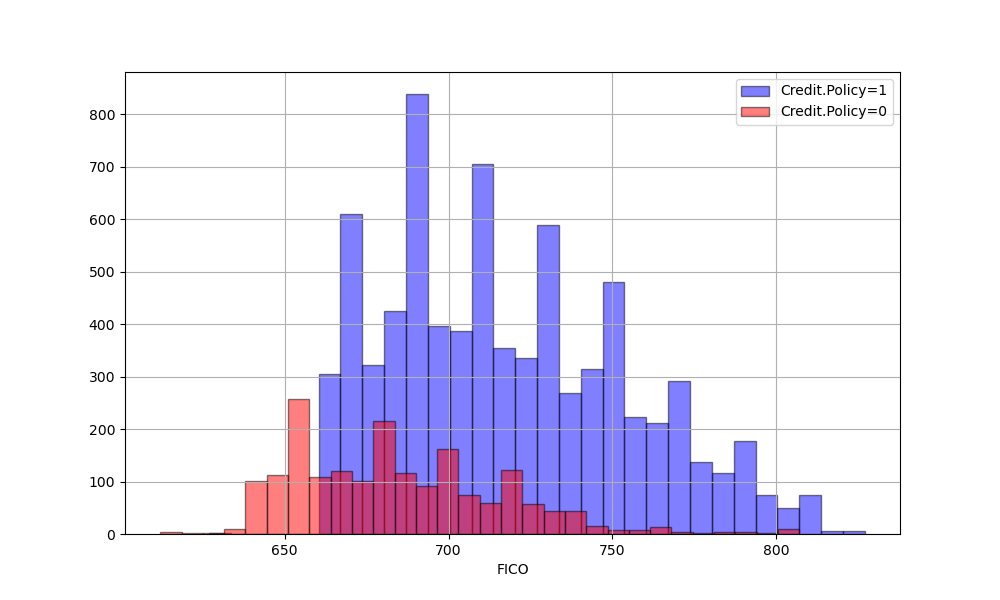
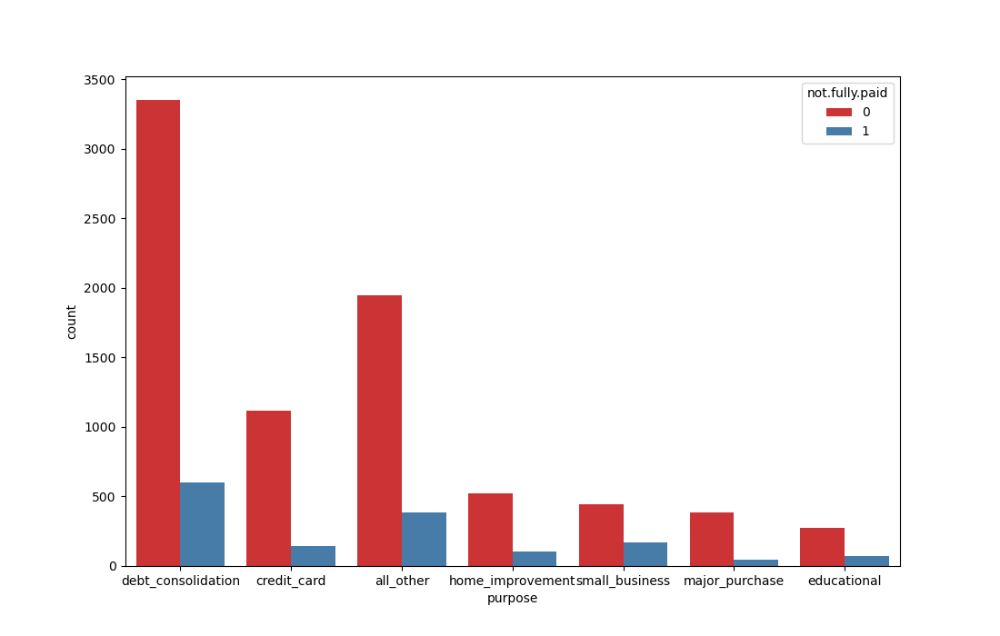
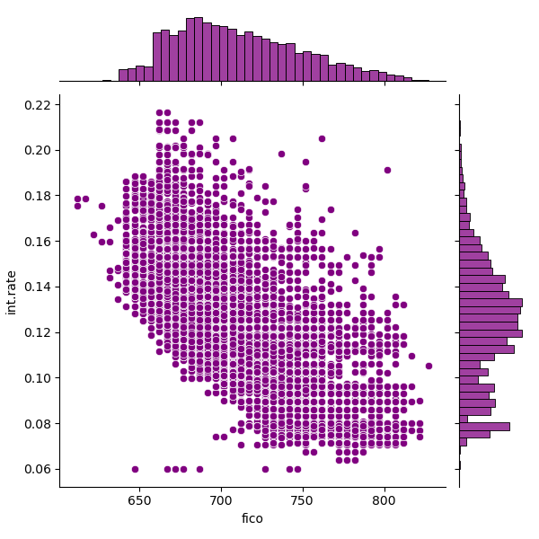
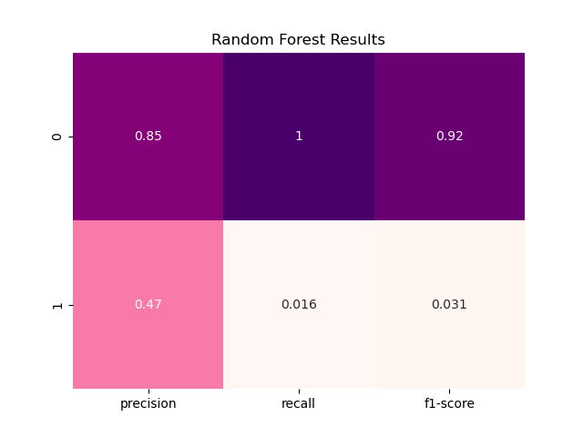
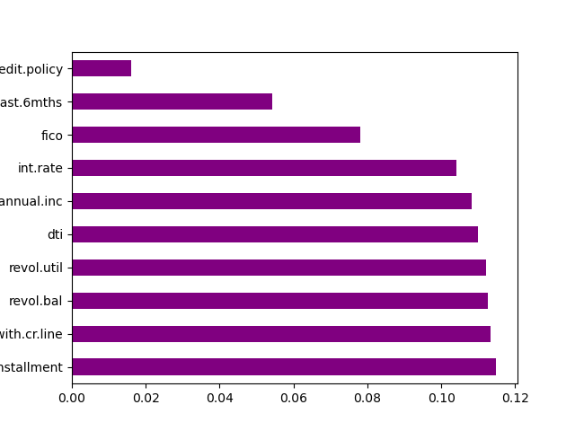

# Random Forest Classification: Predicting Loan Repayment

Built a classification model using LendingClub loan data to predict whether a loan will be fully repaid, comparing a single Decision Tree with a Random Forest ensemble.

---

## Project Overview
In this project, I analysed 9,578 historical loan records to predict loan repayment outcomes. I compared a baseline Decision Tree model with a Random Forest classifier to understand the trade-off between interpretability and predictive performance, and to identify which borrower features were most informative for default risk.

---

## Exploratory Data Analysis
Before modelling, I explored relationships between credit scores, interest rates, loan purposes, and repayment outcomes.

### 1. FICO Score and Credit Policy
  
Visualised how FICO scores align with LendingClub’s credit policy, showing a clear increase in loan approval rates around the 660 threshold.

### 2. Loan Purpose and Repayment
  
Examined repayment outcomes across different loan purposes. While debt consolidation and credit cards were the most common loan types, default rates varied by category.

### 3. Credit Score vs Interest Rate
  
Confirmed the expected inverse relationship between FICO score and interest rate, with higher default rates concentrated in lower FICO and higher interest regions.

---

## Baseline Model: Decision Tree
A single Decision Tree classifier was trained as a baseline model.


- The Decision Tree was easy to interpret but showed signs of overfitting.
- Performance varied significantly with small changes in the data, highlighting its sensitivity to noise.

---

## Model Evaluation: Random Forest
Models were evaluated using a 30% test split, comparing the Decision Tree with a Random Forest consisting of 600 trees.



- The Random Forest achieved more stable performance than the single Decision Tree.
- Ensemble averaging reduced variance and improved generalisation.

---

## Feature Importance


Feature importance analysis showed that behavioural variables were more influential than static credit scores:

- **Revolving utilisation and installment amount** were the strongest predictors of repayment behaviour.
- **FICO score** contributed a relatively small proportion of the model’s overall importance in this dataset.

---

## Key Takeaways
- Decision Trees are interpretable but prone to overfitting on noisy financial data.
- Random Forests reduce variance and provide more reliable predictions.
- Current borrowing behaviour was more informative than historical credit scores alone.
- Recall for default cases was relatively low, indicating that further tuning (e.g. class weighting or resampling) would be necessary in a real banking environment.

---

## How to Run
```bash
pip install pandas seaborn scikit-learn
jupyter notebook "Decision Trees and Random Forest Project.ipynb"
